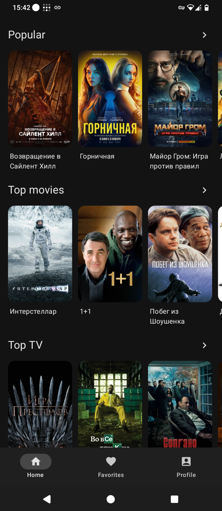
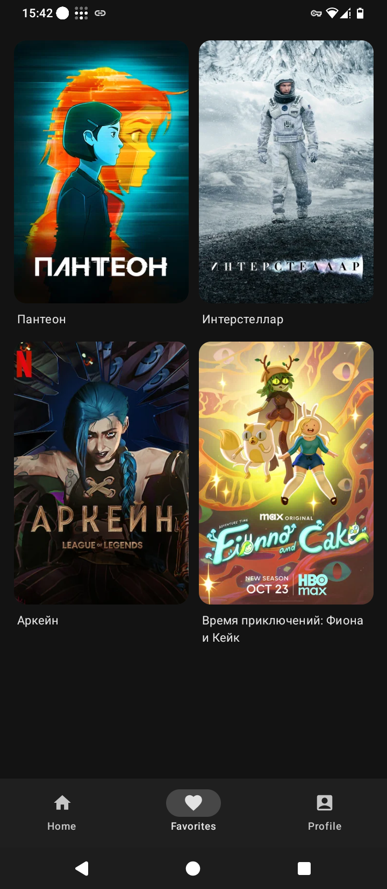
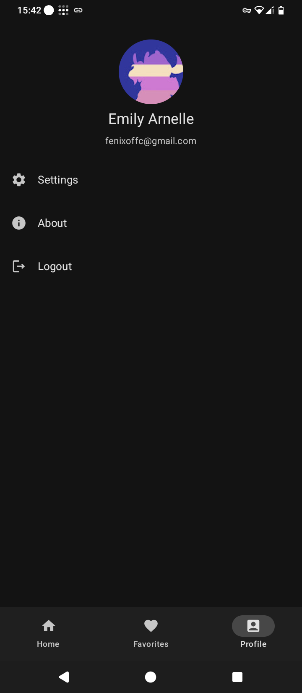
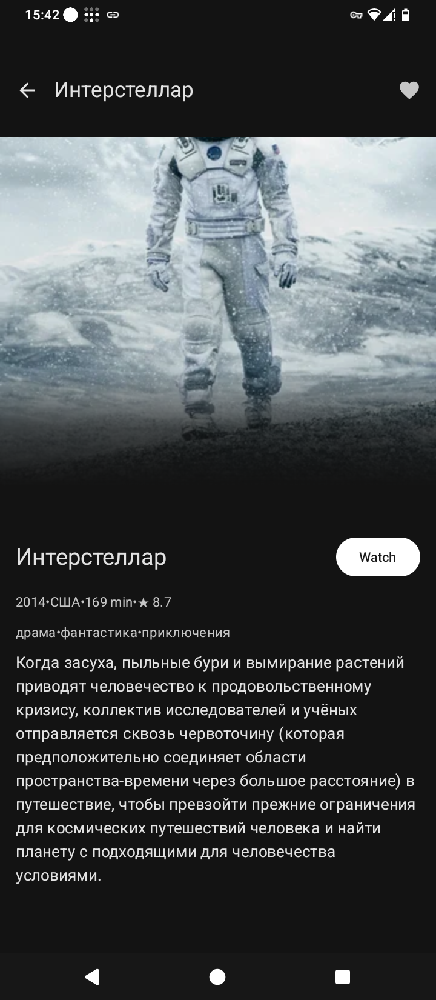
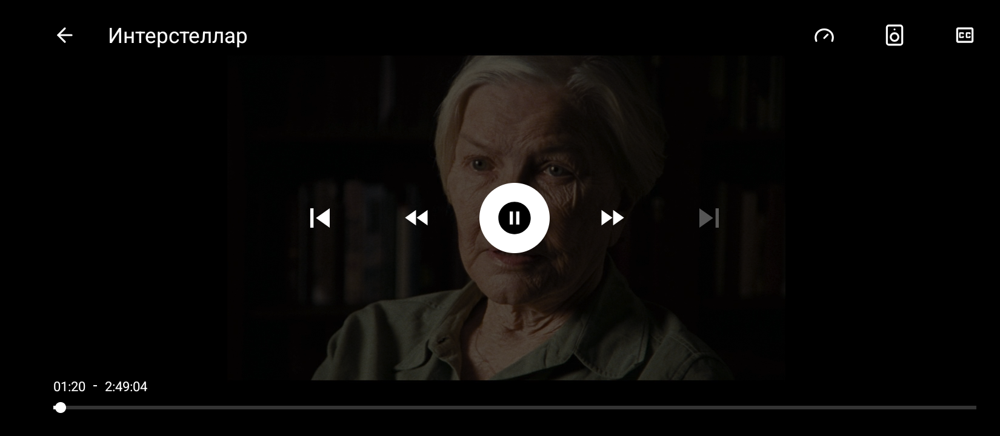

# NeoMovies

### Movies & series streaming client for Android

## Screenshots

## Download

- Download the latest stable APK from GitHub Releases:
  - https://github.com/Neo-Open-Source/neomovies-android/releases/latest
- Preview (pre-release) builds:
  - https://github.com/Neo-Open-Source/neomovies-android/releases

## License

See [LICENSE](LICENSE).
